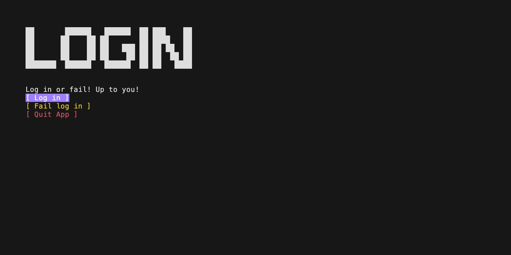
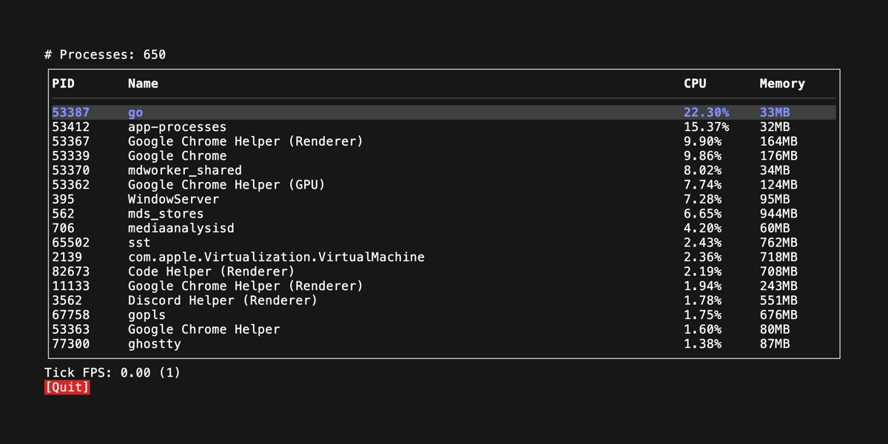
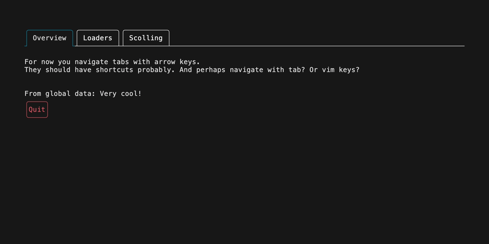
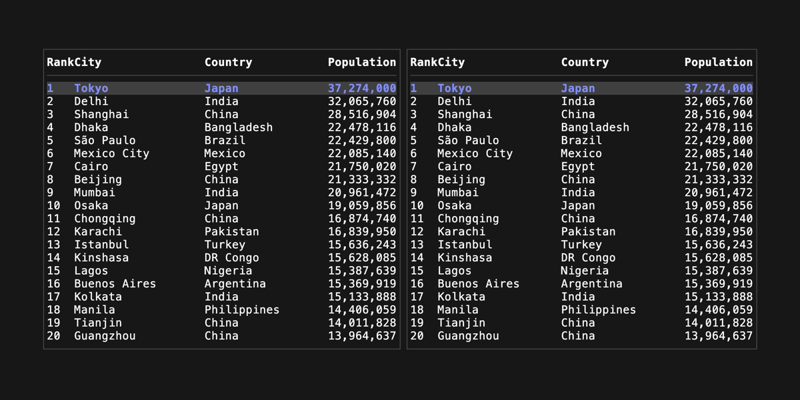
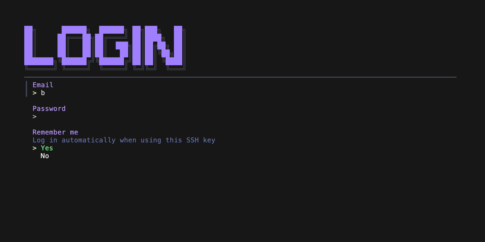
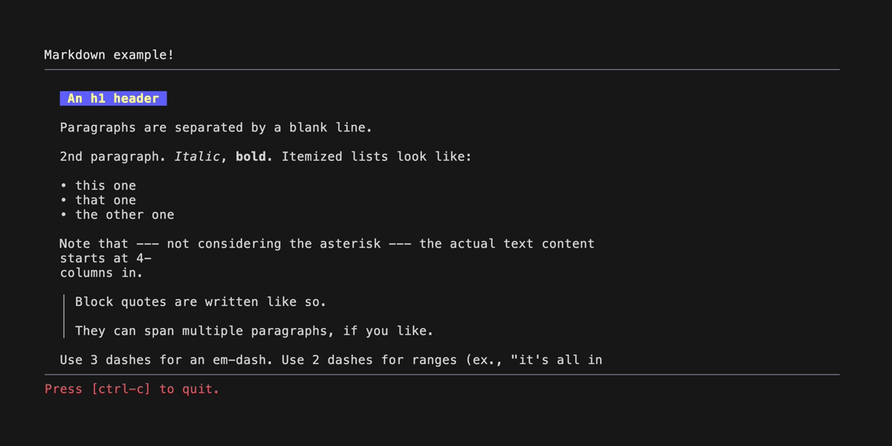
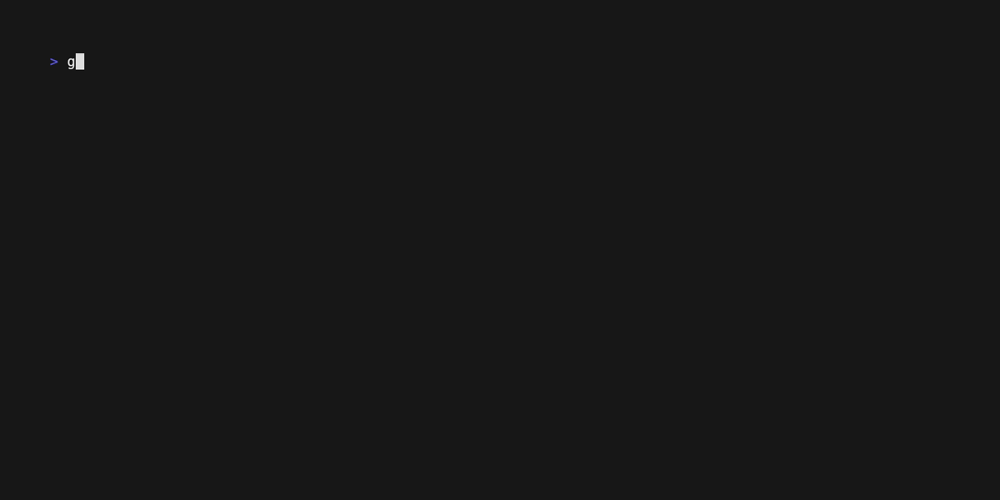

# BubbleApp

> [!WARNING]
> This is work in progress. Help is welcome.

An opinionated App Framework for BubbleTea. Using composable functional components and hooks it becomes easy to make large BubbleTea apps without too much code. See the examples for how it works.

## Components

- **[Layout Components](#layout-components)**
  - [Stack](#stack) and (Flex) Box makes it easy to create flexible layouts
- **[Widget Components](#widget-components)**
  - Button, [Loader](#loader), [Tabs](#tabs), Text, [Markdown](#markdown), [Table](#table), [Forms (huh?)](#form) and more to come...

## Features

- **[Functional components](#functional)**
  - Create large apps in a style familiar to a certain web framework. UseState hook for state and UseEffect hook for... well side-effects.
- **Layout Engine**
  - A multi-pass layout algorithm makes it possible to have growing components that take up available space. Enables resposive and flexible layouts.
- **Mouse support** - using [BubbleZone](https://github.com/lrstanley/bubblezone)
  - Automatic mouse handling and propagation for all components.
- **[Focus Management](#focus)**
  - Tab through your entire UI tree without any extra code. Tab order is the order in the UI tree.
- **Global Ticks** IN PROGRESS
  - Adding several Spinners from Bubbles is really slow over SSH since they each start a Tick message. In BubbleTea all components use the same global tick for real time updates.

# Examples

### Minimal example

This is the smallest example of a BubbleApp program. A BubbleApp program is a function that takes a 'context' and some props and returns a string.

It can then in turn use other components (read: functions) to build an app. `text.New` is just a helper that is the same as calling the `func Text(c *app.Ctx, props app.Props) string` function.

Everything is just functions that return strings. It is similar to a certain web framework with functional components and hooks.

```go
package main

import (
	"os"
	"github.com/alexanderbh/bubbleapp/app"
	"github.com/alexanderbh/bubbleapp/component/text"
	tea "github.com/charmbracelet/bubbletea/v2"
)

func NewRoot(c *app.Ctx, _ app.Props) string {
	return text.New(c, "Hello World!")
}

func main() {
	ctx := app.NewCtx()

	bubbleApp := app.New(ctx, NewRoot)
	p := tea.NewProgram(bubbleApp, tea.WithAltScreen(), tea.WithMouseAllMotion())
	bubbleApp.SetTeaProgram(p)
	if _, err := p.Run(); err != nil {
		os.Exit(1)
	}
}
```

---

### [Multiple Views](./examples/multiple-views/login.go)

An example of multiple views with some buttons. The login model is forgotten when navigating away from that view. It is easier to maintain large apps this way instead of a single root model.



---

### [Process list](./examples/app-processes/main.go)

List all running processes in a table. This shows how to utilize the Global Data. Here a goroutine is maintaining the process list separately. Note: The API around updating components will change to something nice at some point.

There is not a lot of code here for the UI. Take a look.



---

## Widget Components

### [Tabs](./examples/tabs/main.go)

```go
var tabsData = []tabs.Tab{
	{Title: "Overview", Content: overview},
	{Title: "Loaders", Content: loaders},
	{Title: "Boxes 🟨", Content: boxes},
}

func NewRoot(ctx *app.Ctx, _ app.Props) string {
	return tabs.New(ctx, tabsData)
}
```



---

### [Loader](./examples/loader/main.go)

```go
loader.New(ctx, loader.Dots, "Loading...", nil),
```


---

### [Table](./examples/table/main.go)

Each table automatically handles mouse hovering rows. They send out messages on state change and focus and keys are handled automatically.

```go
stack := stack.New(ctx, func(ctx *app.Ctx) {
  table.New(ctx, table.WithDataFunc(func(c *app.Ctx) ([]table.Column, []table.Row) {
    return clms, rows
  }))
  table.New(ctx, table.WithDataFunc(func(c *app.Ctx) ([]table.Column, []table.Row) {
    return clms, rows
  }))
}, stack.WithDirection(app.Horizontal))
```



---

### [Form](./examples/form/main.go)

Using [huh](https://github.com/charmbracelet/huh) for form rendering. Perhaps a native BubbleApp form will be created in the future for easier composability.

```go
var loginForm = huh.NewForm(
	huh.NewGroup(
		huh.NewInput().Key("email").Title("Email"),
		huh.NewInput().Key("password").Title("Password").EchoMode(huh.EchoModePassword),
		huh.NewSelect[string]().Key("rememberme").Title("Remember me").Description("Log in automatically when using this SSH key").Options(huh.NewOptions("Yes", "No")...),
	),
)
```

```go
func NewRoot(c *app.Ctx, _ app.Props) string {
	formSubmit, setFormSubmit := app.UseState[*FormData](c, nil)

	return stack.New(c, func(c *app.Ctx) {
		c.Render(loginLogo, nil)

		if formSubmit == nil {
			form.New(c, loginForm, func() {
				setFormSubmit(&FormData{
					email:    loginForm.GetString("email"),
					password: loginForm.GetString("password"),
					remember: loginForm.GetString("rememberme"),
				})
			})
		}

		if formSubmit != nil {
			text.New(c, "Email: "+formSubmit.email, nil)
			text.New(c, "Password 🙈: "+formSubmit.password, nil)
			text.New(c, "Remember me: "+formSubmit.remember, nil)
		}

		box.NewEmpty(c)
		divider.New(c)
		button.New(c, "Quit", c.Quit, button.WithVariant(button.Danger))
	})
}
```



### [Markdown](./examples/markdown/main.go)

Using [Glamour](https://github.com/charmbracelet/glamour) for markdown rendering.

```go
return stack.New(ctx, func(ctx *app.Ctx) {
	text.New(ctx, "Markdown example!")
	divider.New(ctx)

	box.New(ctx, func(ctx *app.Ctx) {
		markdown.New(ctx, mdContent)
	}, box.WithDisableFollow(true))

	divider.New(ctx)
	text.New(ctx, "Press [ctrl-c] to quit.", text.WithFg(ctx.Styles.Colors.Danger))
})
```



---

## Layout Components

### [Stack](./examples/stack/main.go)

Stack layouts vertically or horizontally.

```go
stack := stack.New(c, func(c *app.Ctx) {
  box.NewEmpty(c, box.WithBg(c.Styles.Colors.Danger))
  box.New(c, func(c *app.Ctx) {
    stack.New(c, func(c *app.Ctx) {
      box.NewEmpty(c, box.WithBg(c.Styles.Colors.Primary))
      box.NewEmpty(c, box.WithBg(c.Styles.Colors.Secondary))
      box.NewEmpty(c, box.WithBg(c.Styles.Colors.Tertiary))

    }, stack.WithDirection(app.Horizontal))
  })
  box.NewEmpty(c, box.WithBg(c.Styles.Colors.Warning))
})
```



---

## Features

### Functional

Functional components and hooks as you might be familiar with

```go
func NewRoot(c *app.Ctx, _ app.Props) string {
	clicks, setClicks := app.UseState(c, 0)
	greeting, setGreeting := app.UseState(c, "Knock knock!")

	app.UseEffect(c, func() {
		go func() {
			time.Sleep(2 * time.Second)
			setGreeting("Who's there?")
		}()
	}, []any{})

	return stack.New(c, func(c *app.Ctx) {
		button.NewButton(c, "Count clicks here!", func() {
			setClicks(clicks + 1)
		}, button.WithType(button.Compact))

		text.New(c, "Clicks: "+strconv.Itoa(clicks), text.WithFg(c.Styles.Colors.Warning))
		text.New(c, "Greeting: "+greeting, text.WithFg(c.Styles.Colors.Warning))

		box.NewEmpty(c)

		button.NewButton(c, "Quit", func() {
			c.Quit()
		}, button.WithVariant(button.Danger), button.WithType(button.Compact))
	}, stack.WithGap(1), stack.WithGrow(true))
}
```


### [Focus](./examples/focus-management/main.go)

Global tab management without any extra code. All focusable components are automatically in a tab order (their order in the UI tree).

```go
func NewRoot(c *app.Ctx, _ app.Props) string {
	presses, setPresses := app.UseState(c, 0)
	log, setLog := app.UseState(c, []string{})

	return stack.New(c, func(c *app.Ctx) {
		text.New(c, "Tab through the buttons to see focus state!")

		button.NewButton(c, "Button 1", func() {
			currentLog := log
			currentPresses := presses
			newLog := append(currentLog, "["+strconv.Itoa(currentPresses)+"] "+"Button 1 pressed")
			setLog(newLog)
			setPresses(currentPresses + 1)
		}, button.WithVariant(button.Primary), button.WithType(button.Compact))

		divider.New(c)

		box.New(c, func(c *app.Ctx) {
			text.New(c, strings.Join(log, "\n"))
		})

		divider.New(c)

		button.NewButton(c, "Quit App", func() {
			c.Quit()
		}, button.WithVariant(button.Danger), button.WithType(button.Compact))

	}, stack.WithGrow(true))
}
```


---

# Development

Try out the examples to get a feel for how it works in the terminal.

```sh
git clone git@github.com:alexanderbh/bubbleapp.git
cd bubbleapp/examples/multiple-views
go run .
```

### Planned Features

Here are some planned features in no particular order. Feel free to suggest something.

- **Alignments** - Add justify and align options on relevant components
- **Border and title on Box** - Add borders and titles to Box component
- **Router** - Add a router component that can handle screens, navigation, back history, etc.
- **Speed up Viewport** - Move away from ViewPort to custom stateful variant of a scrolling box
- **Proper theming** - Default themes (or BYOT, bring your own theme)
- **Scroll content** - Scroll with mouse and keyboard on Box (which is an overflow container)
- **Modal Component** - Using canvas/layers approach
- **Confirm Component** - Using modal but is an ok, cancel modal with text
- **Help Text Component**
- **Shortcut support** - global and locally within components in focus perhaps
- **Context Menu Component**
- **Table DataSource** - attach a datasource to a table that can handle fetching, sorting, filtering, etc.
- **Animation Component** - give it a list of frames and an FPS and it handles the rest
- **More shaders** - Color fade-in/out, Typewriter effect, more...

### Shout outs

- Thank you [Charm](https://github.com/charmbracelet) for the amazing BubbleTea framework.
- Thank you [BubbleZone](https://github.com/lrstanley/bubblezone) for making mouse support easy.
