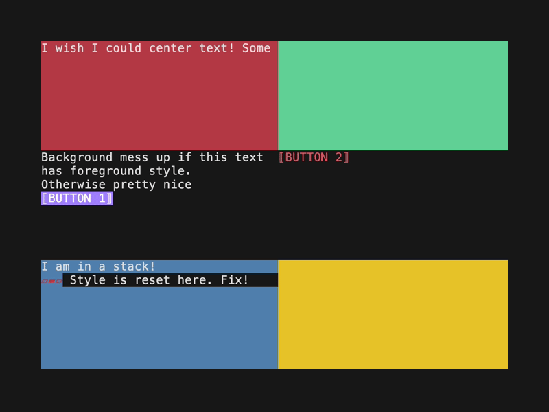
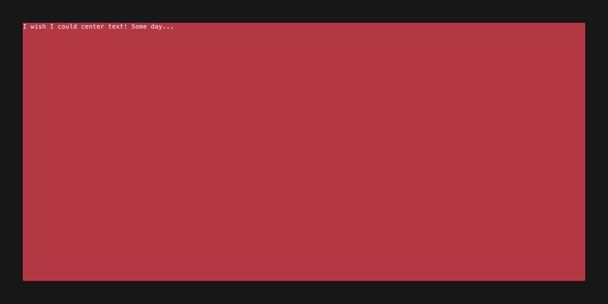

# BubbleApp

> [!WARNING]
> This is work in progress. Help is welcome.

An opinionated App Framework for BubbleTea. Building large BubbleTea apps can be a lot of manual work for every thing shown on the screen. BubbleApp add a separate UI layer on top of the BubbleTea architecture and handles all interoperability.

## Components

- **[Layout Components](#layout-components)**
  - [Stack](#stack), [Grid](#grid), Box makes it easy to create responsive layouts
- **[Widget Components](#widget-components)**
  - Button, Loader, [Tabs](#tabs), Text, [Table](#table) (and more to come)

## Features

- **Mouse support** - using [BubbleZone](https://github.com/lrstanley/bubblezone)
  - Automatic mouse handling and propagation for all components.
- **[Focus Management](#focus)**
  - Tab through your entire UI tree without any extra code. Tab order is the order in the UI tree.
- **Global App State**
  - Every component and model in a BubbleApp has a reference to your global app state (or app instance if using [Wish](https://github.com/charmbracelet/wish)). Use this anywhere in your app for rendering or behavior.
- **Global Ticks**
  - Adding several Spinners from Bubbles is really slow over SSH since they each start a Tick message. In BubbleTea all components use the same global tick for real time updates.
- **[Shaders](#shaders)**
  - Attach shaders to components to transform their output. Dynamic Shaders listen for the Global Tick and can react in real time. The possibilities are endless.

# Examples

### [Multiple Views](./examples/multiple-views/main.go)

An example of multiple views with some buttons. The login model is forgotten when navigating away from that view. It is easier to maintain large apps this way instead of a single root model.


---

### [Process list](./examples/app-processes/main.go)

List all running processes in a table. This shows how to utilize the Global Data. Here a goroutine is maintaining the process list separately. Note: The API around updating components will change to something nice at some point.

There is not a lot of code here for the UI. Take a look.


---

## Widget Components

### [Tabs](./examples/tabs/main.go)

```go
var tabsData = []tabs.TabElement[CustomData]{
	{Title: "Overview", Content: NewOverview},
	{Title: "Loaders", Content: NewLoaders},
	{Title: "Scolling", Content: NewScrolling},
}
```

```go
tabs := tabs.New(ctx, tabsData)

base := app.New(ctx, app.AsRoot())
base.AddChild(tabs)
```


---

### [Table](./examples/table/main.go)

Each table automatically handles mouse hovering rows. They send out messages on state change and focus and keys are handled automatically.

```go
stack := stack.New(ctx, []app.Fc[CustomData]{
    table.New(ctx, clms, rows, nil),
    table.New(ctx, clms, rows, nil),
}, &stack.Options{Horizontal: true})
```


---

## Layout Components

### [Stack](./examples/stack/main.go)

Stack layout vertically or horizontally. Compose as you like.

```go
stack := stack.New(ctx, &stack.Options[CustomData]{
    Children: []*app.Base[CustomData]{
        box.New(ctx, &box.Options[CustomData]{Bg: ctx.Styles.Colors.Danger}),
        box.New(ctx, &box.Options[CustomData]{
            Child: stack.New(ctx, &stack.Options[CustomData]{
                Horizontal: true,
                Children: []*app.Base[CustomData]{
                    box.New(ctx, &box.Options[CustomData]{Bg: ctx.Styles.Colors.Primary}),
                    box.New(ctx, &box.Options[CustomData]{Bg: ctx.Styles.Colors.Secondary}),
                    box.New(ctx, &box.Options[CustomData]{Bg: ctx.Styles.Colors.Tertiary}),
                }},
            ),
        }),
        box.New(ctx, &box.Options[CustomData]{Bg: ctx.Styles.Colors.Warning}),
    }},
)

base := app.New(ctx, app.AsRoot())
base.AddChild(stack)
```


---

### [Grid](./examples/grid/main.go)

If you need more responsive layouts use a Grid which can span 12 unit across the width. Each item in the grid has a width for each breakpoint (the size of the terminal).

```go
gridView := grid.New(ctx,
    grid.Item[CustomData]{Xs: 12,
        Item: box.New(ctx, &box.Options[CustomData]{Bg: ctx.Styles.Colors.DangerDark,
            Child: text.New(ctx, "I wish I could center text! Some day...", nil),
        }),
    },
    grid.Item[CustomData]{Xs: 6,
        Item: box.New(ctx, &box.Options[CustomData]{Bg: ctx.Styles.Colors.Success}),
    },
    grid.Item[CustomData]{Xs: 6,
        Item: stack.New(ctx, &stack.Options[CustomData]{
            Children: []*app.Base[CustomData]{
                text.New(ctx, "Background mess up if this text has foreground style.", nil),
                text.New(ctx, "Fix the margin to the left here. Not intentional.", nil),
                button.New(ctx, "BUTTON 1", &button.Options{Type: button.Compact}),
            },
        }),
    },
    grid.Item[CustomData]{Xs: 3,
        Item: button.New(ctx, "BUTTON 2", &button.Options{Variant: button.Danger, Type: button.Compact}),
    },
    grid.Item[CustomData]{Xs: 6,
        Item: box.New(ctx, &box.Options[CustomData]{Bg: ctx.Styles.Colors.InfoDark,
            Child: stack.New(ctx, &stack.Options[CustomData]{
                Children: []*app.Base[CustomData]{
                    text.New(ctx, "I am in a stack!", nil),
                    loader.New(ctx, loader.Meter, &loader.Options{Color: ctx.Styles.Colors.DangerDark, Text: "Loader is loading!"}),
                },
            }),
        }),
    },
    grid.Item[CustomData]{Xs: 3,
        Item: box.New(ctx, &box.Options[CustomData]{Bg: ctx.Styles.Colors.Warning}),
    },
)

base := app.New(ctx, app.AsRoot())
base.AddChild(gridView)
```




---

## Features

### [Shaders](./examples/shader/main.go)

Flexible system to add shaders to components. Dynamic shaders are getting the global tick which enables them to update in real time.

Could be used for easy animations or transitions in the future.

```go
stack := stack.New(ctx, &stack.Options[struct{}]{
    Children: []*app.Base[struct{}]{
        text.New(ctx, "Shader examples:", nil),
        text.New(ctx, "Small Caps Shader", &text.Options{Shader: shader.NewSmallCapsShader()}),
        button.New(ctx, "blink", &button.Options{
            Variant: button.Danger,
            Shader: shader.NewCombinatorShader(
                shader.NewSmallCapsShader(),
                shader.NewBlinkShader(time.Second/3, lipgloss.NewStyle().Foreground(ctx.Styles.Colors.Success).BorderForeground(ctx.Styles.Colors.Primary)),
            ),
        }),
    }},
)

base := app.New(ctx, app.AsRoot())
base.AddChild(stack)
```


---

### [Focus](./examples/focus-management/main.go)

Global tab management without any extra code. All focusable components are automatically in a tab order (their order in the UI tree).

```go
addButton := button.New(ctx, "Button 1", func(ctx *app.Context[CustomData]) {
    ctx.Data.log = append(ctx.Data.log, "["+strconv.Itoa(ctx.Data.presses)+"] "+"Button 1 pressed")
    ctx.Data.presses++
}, &button.Options{Variant: button.Primary, Type: button.Compact})

logMessages := box.New(ctx,
    text.NewDynamic(ctx, func(ctx *app.Context[CustomData]) (log string) {
        return strings.Join(ctx.Data.log, "\n")
    }, nil), nil)

stack := stack.New(ctx, []app.Fc[CustomData]{
    text.New(ctx, "Tab through the buttons to see focus state!", nil),
    addButton,
    divider.New(ctx),
    logMessages,
    divider.New(ctx),
    button.New(ctx, "Quit App", app.Quit, &button.Options{Variant: button.Danger, Type: button.Compact}),
}, nil)
```


---

# Development

Try out the examples to get a feel for how it works in the terminal.

```sh
git clone git@github.com:alexanderbh/bubbleapp.git
cd bubbleapp/examples/multiple-views
go run .
```

### Planned Features

Here are some planned features in no particular order. Feel free to suggest something.

- **Polish** - finish up the existing components and their interfaces. Align things like component options, margins, paddings, etc.
- **Modal Component**
- **Help Text Component**
- **Shortcut support** - global and locally within components in focus perhaps
- **Context Menu Component**
- **Table DataSource** - attach a datasource to a table that can handle fetching, sorting, filtering, etc.
- **Animation Component** - give it a list of frames and an FPS and it handles the rest
- **More shaders** - Color fade-in/out, Typewriter effect, more...

### Shout outs

- Thank you to [Charm](https://github.com/charmbracelet) for the amazing BubbleTea framework.
- Thank you to [BubbleZone](https://github.com/lrstanley/bubblezone) for making mouse support easy.
